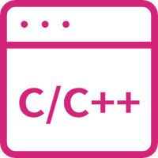

## Hi there, I'm Harry Xiong 👋

<!--
**HarryXiong24/HarryXiong24** is a ✨ _special_ ✨ repository because its `README.md` (this file) appears on your GitHub profile.

Here are some ideas to get you started:

- 🔭 I’m currently working on ...
- 🌱 I’m currently learning ...
- 👯 I’m looking to collaborate on ...
- 🔭 I'm currently working on ...
- 🤔 I’m looking for help with ...
- 💬 Ask me about ...
- 📫 How to reach me: ...
- 😄 Pronouns: ...
- ⚡ Fun fact: ...
-->

#### :raised_hand: About Me

- 🌟 Motto: Nothing is impossible for a willing heart.
- 🌱 Hobby: Coding & Piano & 🏀 &  🏊‍♂️ & 🏸 & 🚴‍♂️ & 🎤 & etc.
- 🤟 Blog: [Harry's Blog](https://www.harryxiong24.com)
- 🏡 Hometown: China
- ⚡ Fun fact: Oops!😝😝😝
- 📫 How to reach me: 💌harryxiong24@gmail.com & 💌harryxiong24@qq.com
- 😊 Nice to meet you!

#### 🛠 Languages and Tools  

  <code></code>
  <code></code>
  <code></code>
  <code></code>
  <code></code>
  <code></code>
  <code></code>
  <code></code>
  <code></code>
  <code></code>
  <code></code>
  <code></code>
  <code></code>
  <code></code>

  
#### :trophy: Coding Info

  
  

  

#### :hearts: Following Me

<!-- **Item**
 -->

